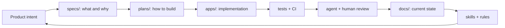

# Software Factory Starter

A sample repository for building AI-assisted software teams with repeatable engineering loops.

This repo is intentionally small. It contains templates, dummy apps, agent instructions, review loops, MCP policy examples, and CI scaffolding that show how to move from vibe coding to vibe engineering.

## What This Demonstrates

- `AGENTS.md` as the operating contract for humans and agents.
- `design.md` as a durable design contract.
- `specs/`, `plans/`, and `docs/` as separate artifacts.
- Spec-driven development where agents research and plan before code.
- Agent skills for repeatable workflows.
- MCP/tool boundaries with explicit trust and permission rules.
- Agentic code review as a self-enforcing loop.
- TDD, CI, and validation gates.
- Containers/runtime-image thinking without requiring real infrastructure.

## Repository Layout

```text
.
├── AGENTS.md
├── design.md
├── .agents/skills/
├── .cursor/rules/
├── apps/
│   ├── service/
│   └── web/
├── docs/
├── specs/
├── plans/
├── templates/
├── mcp/
└── .github/workflows/
```

## Quick Start

```bash
make test
make lint
```

The sample backend uses only the Python standard library so the starter can run without dependency setup.

## Factory Loop



## Intended Use

Use this repository as a template. Replace the dummy app with your real product, but keep the factory surfaces:

1. Write the spec.
2. Ask the agent to research and write the plan.
3. Implement against the plan.
4. Run tests and CI.
5. Ask a review agent to inspect the diff.
6. Promote recurring lessons into docs, skills, rules, or tests.

