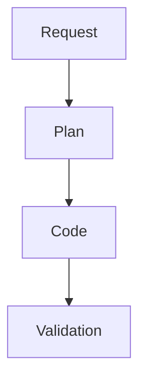

# PLAN_<NAME>

## Goal

State the concrete outcome.

## Repo Research

- Files inspected:
- Docs/specs consulted:
- Existing patterns:

## Implementation Details

- API signatures:
- Data models:
- Files to change:
- Feature flags:
- Error handling:

## Tests

- Unit:
- Integration:
- E2E:

## Rollout

- Migration:
- Backout:
- Docs:

## Mermaid

